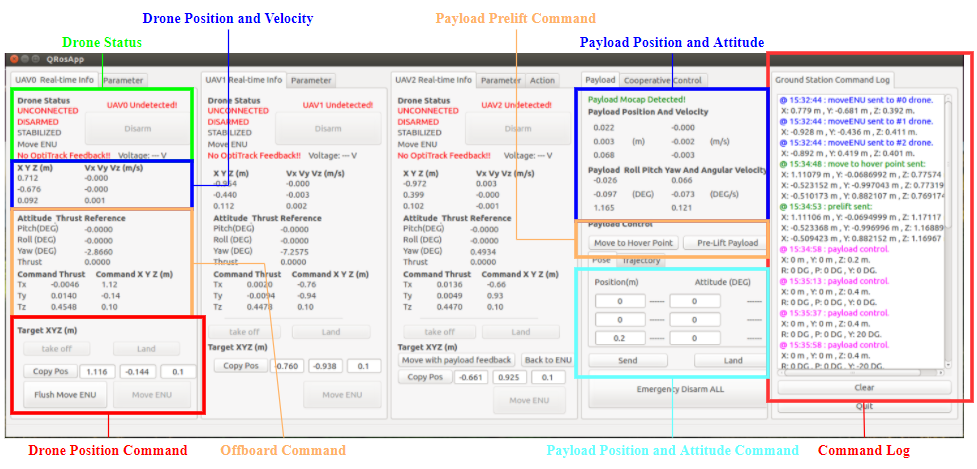

# QT Ground Station App For Mult-drone Command and Control

## Panel description：

The ground station app is responsible for sending commands for quadrotor experiments in [Flight System and Control Lab (FSC)](https://www.flight.utias.utoronto.ca/fsc/index.php/payload/). 
The ground station app should be download and installed on the ground station computer.  The ground station app supports max three control channels, ranging from uav0 to uav2. The list of  functions of the ground station app are:
> 1. Inspecting wifi connection and battery status of every connected drone
> 2. Sending Move ENU command to every connected drone to a given position
> 3. Sending action command to every connected drone to perform special missions
> 4. Inspecting payload motion
> 5. Sending command to drones to perform payload manipulation mission
> 5. Displaying and recording command history

The app panel description is shown in the above picture.  The coordinate system used in the app is ENU frame. The x direction points away from the ground station desktop to the opposite wall. The positive y direction points to the left wall and the z direction points upwards.  

## How to use:

This qt-based app needs [Qt-ROS package](http://wiki.ros.org/qt_ros?distro=kinetic). Read and build the [tutorial](http://wiki.ros.org/qt_ros/Tutorials) first to make sure that `qt_build` and `qt_create` works properly.  (Or you can use [another useful tutorial](https://www.cnblogs.com/casperwin/p/6206193.html))

After you can successfully create and build the [default ros-qt project](http://wiki.ros.org/qt_create/Tutorials/Qt%20App%20Templates), you may install the ground station app using the following common commands:

> 1. $ cd yourws/src/
> 2. $ git clone https://github.com/LonghaoQian/qt_ground_station
> 3. $ cd ../..
> 4. $ catkin build

## Preflight check:

Before taking flight, the following steps must be done:

>1.  Check the drone connection status in the **Drone Status** area. All red words except **DISARMED** should be green.  **DISARMED** will turn into a green **ARMED** if the arming switch on the radio transmitter is toggled to arm position. 
>2. Check the battery voltage in the **Drone Status** area. Make sure that it is above a safety threshold. 
>3. Check whether the drone is at the correct takeoff position through **Drone Position and Velocity** area. 
>4. If a drone is connected, the  `Move ENU`  button on the corresponding tab will be enabled.  Use `Copy Pos` button to copy to current position of the quadrotor into the edit window beside it. Then add 0.3 - 0.4 meter to the z direction value as the takeoff height.  After this, press `Move ENU` to send the 1st position command. 
>5.  In **Offboard Command** area, for the 1st command, the yaw value of `Attitude Thrust Reference`  should range from -5(DEG) to +5(DEG). The Tz value of `Command Thrust` should be around 0.5. Tx and Ty should close to 0. 
>6. Make sure the radio transmitter is **turned off**. Go into the net and lift the drone from the ground to a certain height and observe the change in Tz. If Tz reduces with the altitude rising, then the position feedback loop is normal.  
>7. Put the drone back to the takeoff position, close the net, and be read to command the drone to takeoff. 

## Takeoff procedure:

- For single-drone experiment, the procedure is:

>1. Do the preflight check. Check the switches and control sticks on each radio transmitter. Make sure that arm switch and offboard switch are in the disarm and manual position respectively. Make sure that the throttle stick is at the lowest tick. 
>2. Turn on the radio transmitter. Check if the light on the radio receiver is green. 
>3. Toggle the arm switch to arm position. If the propeller starts spinning, it means that the drone is successfully armed. 
>4.  Wait for at least 1s,  and then toggle the offboard switch to offboard position. At this instance, the drone should takeoff and hover at the command height set in the preflight check phase. If the drone exhibits any unexpected movements, toggle the offboard switch back to manual immediately and disarm. 
>5. If the drone hovers at the command height, send subsequent position commands.

- For multi-drone experiment, the procedure is:

>1. Do the preflight check. Make sure each drone is at the correct takeoff position in the correct order. Input 0.2m in the z direction of the payload position command edit window in **Payload Position and Attitude Command** area.  (front uav0, right uav1, left uav2) 
>2. Repeat the takeoff steps for **single drone experiment** for each drone.
>3. Press `Move to Hover Point` button in  **Payload Prelift Command** area. This will command each drone to hover at 0.7m above the tether point. Check whether the string is tangled with any objects such as landing gear and the payload struct beam.  
>4. Press `Pre-Lift Payload`button in **Payload Prelift Command** area. This will command each drone to hover at 1.1 m - 1.2m above the tether point, stretching the cable. 
> 5. If all the cables are stretched,  press `send`button in  **Payload Position and Attitude Command** area to command the quadrotor formation into payload manipulation mode.
> 6. The payload may move to the side or backwards due to the transient phase of the disturbance estimator. If the drone is too close to the wall or the net, press `land` button in  **Payload Position and Attitude Command** area to switch the drones back to position hold mode with a default height of 0.7m for safe landing. The payload platform is susceptible to ground turbulence caused by propeller downwash, so command the payload to a height of 0.4m after the controller stabilizes the payload near the initial takeoff position (x= 0m, y = 0m, z = 0.2m).
> 6. Send subsequent payload position and attitude commands.

##  Landing procedure:

- The landing procedure for single-drone experiment is:

>1. Command the drone to the center of the flyable space and set the command height to 0.4m.
> 2. After the drone descents to the command height, continue decreasing the command height until the landing gear is very close to the ground. 
> 3. Toggle the offboard switch on the radio transmitter to manual mode. This should end the automatic flight and land the drone. Try commanding the drone to hover as close to the ground before toggling the offboard switch to avoid strong shock to the onboard computer. (Too strong shock may disconnect the SD card on jetson nano, causing the computer unable to start in the subsequent flight)
> 4. Wait for at least 1s, toggle the arm switch to disarm position. The propeller should stop spinning. If the propeller still spins, toggle the arm switch back to arm position, wait for at least 1s, and disarm again. 
> 5. Turn off radio transmitter before entering the net. Unplug the battery before picking up the drone. 

- The landing procedure for multi-drone experiment is:
> 1. Move the payload to the center of the flyable area and descent to a height of 0.2m. (dropping the payload from too high may damage the part on the end of the beam.)
> 2. Press the  `land` button in  **Payload Position and Attitude Command** area to drop the payload on the ground. The drone will hover at 0.7m above the ground. 
> 3. Repeat the steps of **The landing procedure for single-drone experiment**. The only change is to land the quadrotor near their hover position instead of the center of the flyable area. 

## Troubleshooting:

The following issues may happen during the experiment:

-  loss of connection: drone status area turns red during the flight or on the ground
> Check Wifi status. If this happens during the experiment. The drone will automatically switch back to manual mode and land. Once this happens during the experiment, toggle the offboard switch to manual for the disconnected drone immediately. Wait for 0.5s and disarm the drone. Then command all other drones to land. 

- Unable to connect: after starting the controller, the status area remains red but the terminal window indicates that the communication link is normal.
> Close the ground station and all the ssh window.
> Restart the ground station.

- Unstable movement: the control parameter is not well tuned or there is a bug in the control code.

> If observed, the operator of the ground station should command the drone or the payload to position hold mode or land mode for single-drone experiment and multi-drone experiment respectively immediately. The ground station operator can abort the experiment by pressing the  `land` button in  **Payload Position and Attitude Command** area for multi-drone experiment without consulting the radio transmitter operator if he/she decides that it is no longer safe to fly the drones. 

-  Ground station crash
> Under some rare circumstances, the ground station may crush during the experiment. If this does happen, do not panic and restart the ground station. The drone will continue executing the last command and restarting the ground station will not affect the drone. 

## Safety guidelines:

**Under no circumstances should one**

>1. command the drone to take off without finishing the preflight check.
>2. walk into the net with radio transmitter turned on.
>3. get close to the drone when the radio transmitter is on and the battery is plugged in. If the drone needs testing, take the propeller off before plugging in the battery.
>4. plug the battery in without taking the propeller off outside the net.
